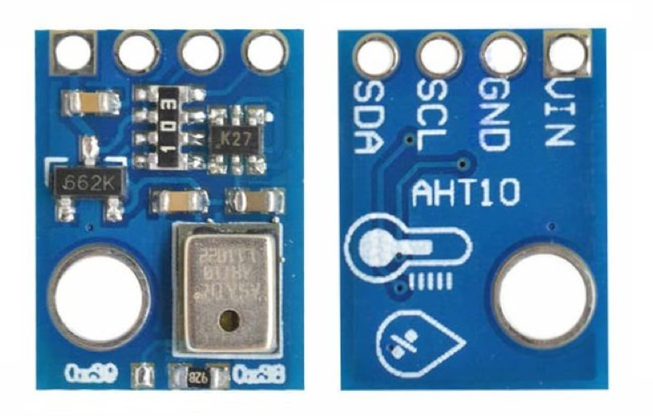

# MicroPython driver for AHT10 sensor

MicroPython driver for AHT10 temperature and humidity sensor over I2C. AHT10 senor may not work with other I2C devices. If that happens use newer version of sensor eg. AHT20 or AHT30.


## Hardware

-   MicroPython compatible development board with I2C support eg. [Raspberry Pico](https://www.raspberrypi.com/products/raspberry-pi-pico/)
-   AHTx0 sensor eg.:
    -   AHT10 ([Datasheet_1](docs/AHT10.pdf), [Datasheet_2](docs/AHT10_unofficial.pdf))

## Software

-   [MicroPython](https://micropython.org/download/) - firmware for your development board

## Installation

-   Copy the `aht10.py` file or `lib` folder to the root of your MicroPython device filesystem.

## API Interface

-   `AHT10(i2c: I2C, i2c_address: int)`

    -   `i2c`: An instance of the I2C interface.
    -   `i2c_address`: The I2C address of the sensor (default: `0x38`).

-   `readings -> tuple[float, float]` (property) - reads both temperature in Celsius and humidity in %. Triggers 1 measurement cycle.

-   `temperature() -> float` (property) - reads temperature in Celsius. Triggers 1 measurement cycle.

-   `humidity -> float` (property) - reads humidity in %. Triggers 1 measurement cycle.

## Code examples

Working example can be found in [main.py](main.py)

```py
from lib.ahtx0 import AHT10
from machine import Pin, I2C

i2c = I2C(0, scl=Pin(9), sda=Pin(8))
sensor = AHT10(i2c=i2c)

print(sensor.readings)  # (temperature, humidity)
```
